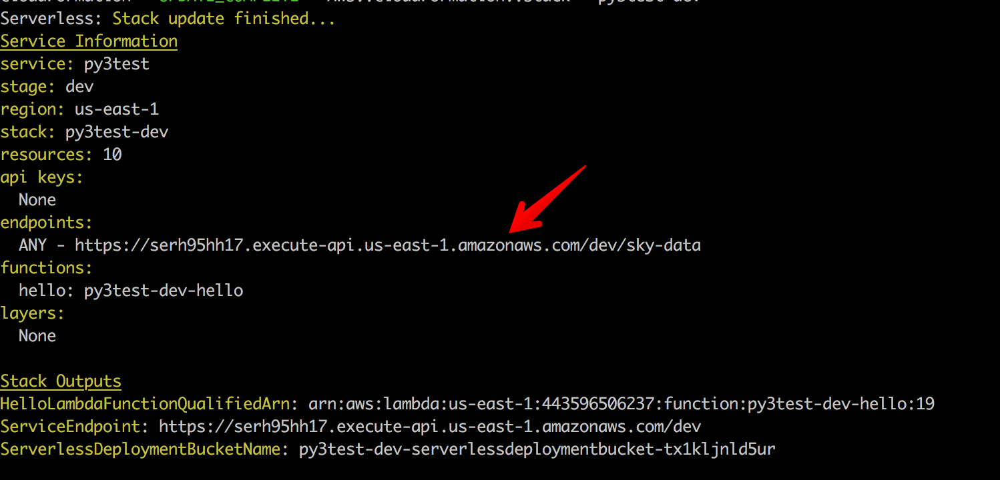

# Python AWS Lambda Docker Serverless

A boilerplate for Python AWS Lambda Docker Serverless

##### Installation steps
* Go to https://console.aws.amazon.com/iam/home?region=us-east-1#/security_credentials
* Create `New Access Key`
* Clone this repo.
* `cd AWS-Lambda-Python-Docker-Serverless`
* `touch .env.docker`
* Update `aws_access_key_id` and `aws_secret_access_key`

##### Run and deploy
* Run `bash run.sh`
* Within docker shell `sls deploy -v`
* Visit the API URL once it's displayed.
* To destroy and remove lambda/api `sls remove`.

